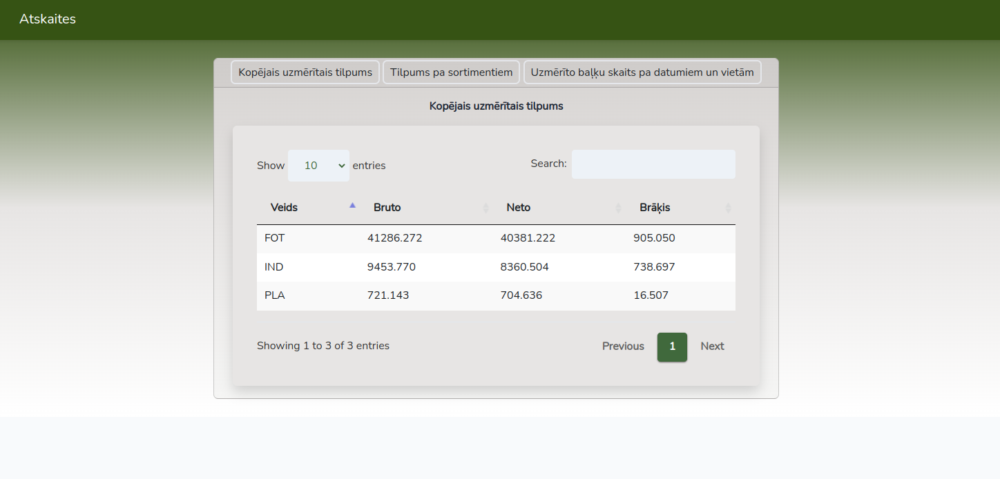
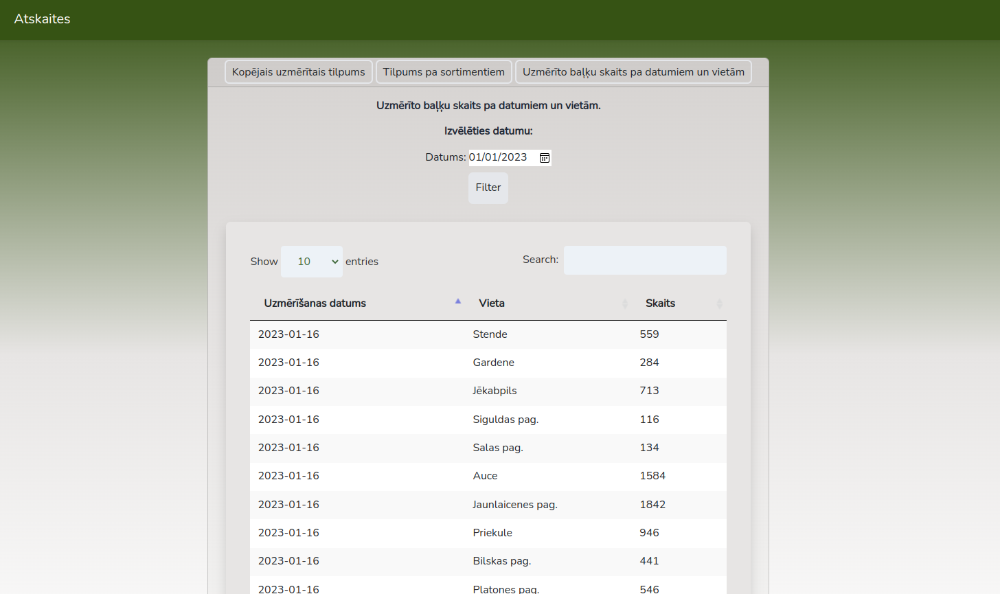

## KPDC Uzdevums
### Author: [Niks Kuprēvičs](https://www.linkedin.com/in/niks-kupr%C4%93vi%C4%8Ds/)

### Instruction to set up the project on your local machine
1. Clone the repository
2. Run `npm install` to install all the dependencies
3. Import database files by running `php artisan migrate`
4. Run `php artisan serve` and `npm run dev` to start the project
5. Open locally hosted project link in your browser

### Screenshots

