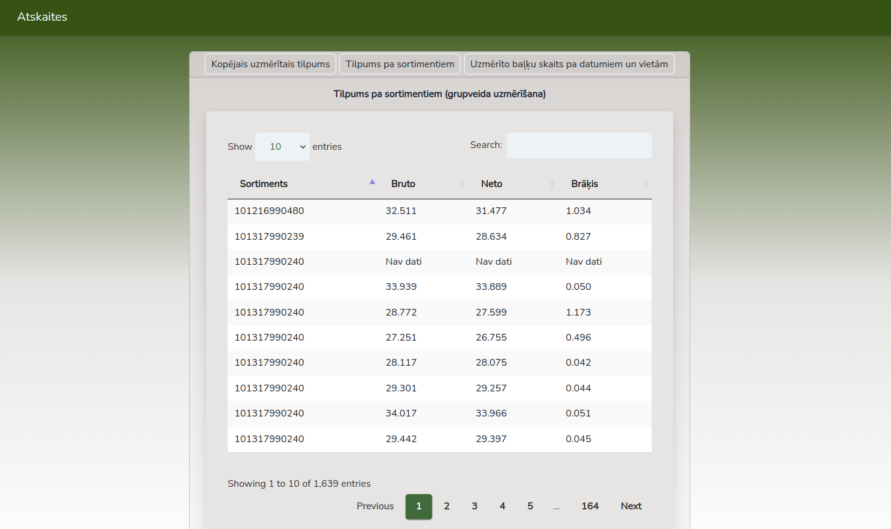

## KPDC Uzdevums
### Author: [Niks Kuprēvičs](https://github.com/nkuprevics)

### Instruction to set up the project on your local machine
1. Clone the repository
2. Run `npm install` to install all the dependencies
3. Import three database .sql files into your local database by running these commands
    - `mysql -u root -p "your database name" < kpdc_registrs.sql`
    - `mysql -u root -p "your database name" < kpdc_registrs_grup.sql`
    - `mysql -u root -p "your database name" < kpdc_registrs_ind.sql`
4. Run `php artisan serve` and `npm run dev` to start the project
5. Open locally hosted project link in your browser

### Screenshots

